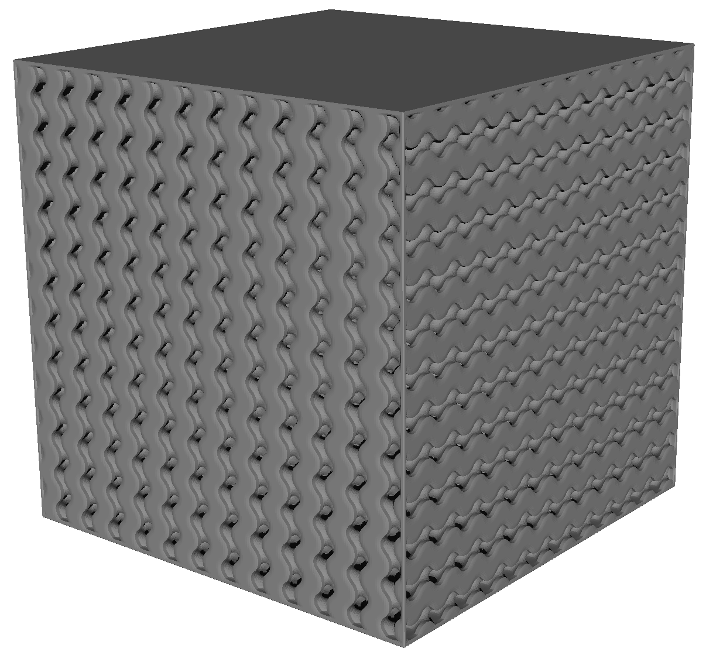
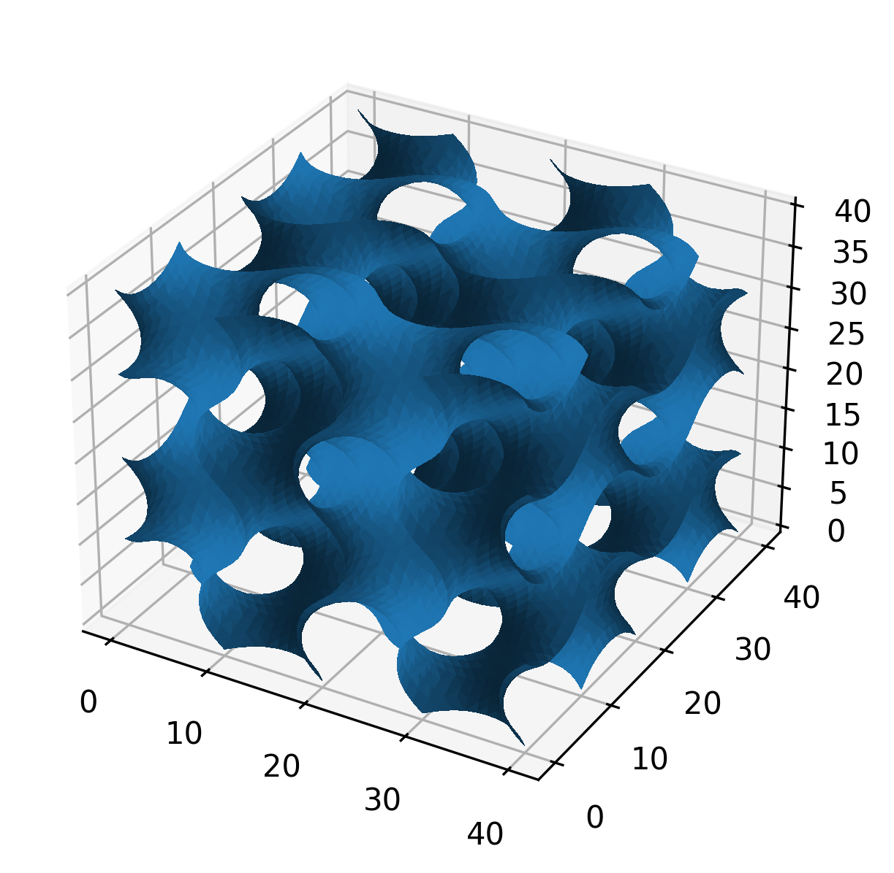
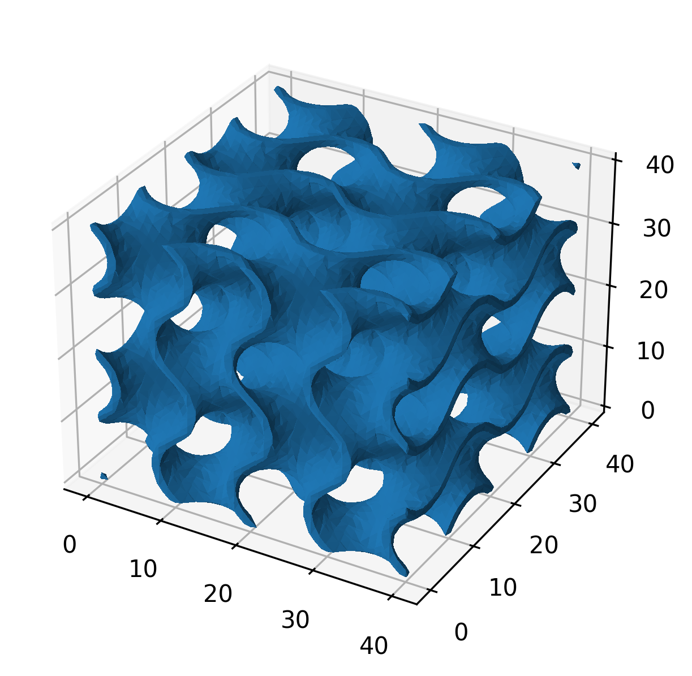
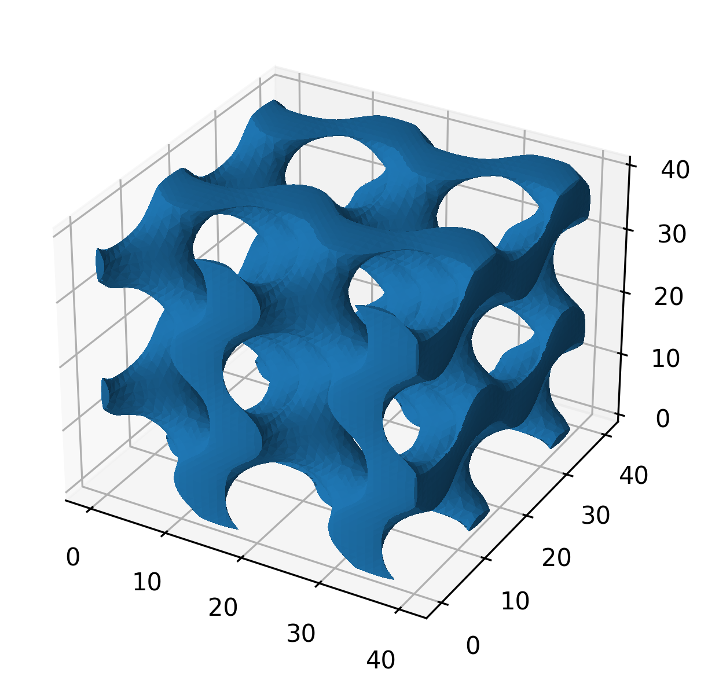

# TPMS

Generates a mesh representing a **[Schoen gyroid](https://en.wikipedia.org/wiki/Gyroid)**, which is  is an infinitely connected **triply periodic minimal surface** discovered by Alan Schoen in 1970.

The exiting thing with the gyroid is the high surface area and turbulent flow which makes it suitable for heat exchanger applications.

Currently, parametric CAD softwares aren't suitable to draw these kind of surfaces so they need to be created as mesh.

This is, as far as I know, the only open source gyroid generator that:  
* can generate alternating lids, creating a heat exchanger core with separated hot/cold volumes, while also
* does not rely on any other software than Python and Python packages.


&#x2615; [Buy me a coffee :)](https://paypal.me/davidalind)

<p align="center">

</p>
Config file for the above:

```
metadata:
  filename: gyroid_s120_r240_he1_p12_s0
mesh:
  size: 120
  resolution: 240
  heat exchanger: 1
gyroid:
  periodicity: 12
  strut param: 0
```

<a name="inital_setup"></a>
## Inital setup

You need python installed. ([Python doc on Windows](https://docs.python.org/3/using/windows.html))

Clone repo (or download and unzip https://github.com/kludda/TPMS):
```
git clone https://github.com/kludda/TPMS.git
```
Enter `TPMS` folder using a shell e.g. Windows Powershell.

Not necessary but highly recommended: set up a [virtual environment for python](https://docs.python.org/3/library/venv.html) and activate (commands are for Windows, if you're on *nix you probably know how to find out):

```
python -m venv .\.venv 
.\.venv\Scripts\activate
```

Install required packages:
```
python -m pip install -r requirements.txt
```

>You can edit `requirements.txt` and remove `matplotlib` if you don't want to use `--png` or `--show`.


## CLI

```
usage: generate.py [-h] [--log LOG] --conf CONF [--stl] [--txt] [--png] [--show]

options:
  -h, --help   show this help message and exit
  --log LOG    DEBUG, INFO, WARNING
  --stl        Save mesh to STL. Will overwrite if exist.
  --txt        Save conf and extra data to a text file as prettyfied json. Will overwrite if exist.
  --png        Save a PNG. Will overwrite if exist.
  --show       Show generated mesh in a window.

required:
  --conf CONF  Your configuration file.
```

* **--conf CONF** Your [YAML configuration file](#conf) containing the parameters of the mesh to generate.

* **--stl** Save the generated mesh to an [STL](https://en.wikipedia.org/wiki/STL_(file_format)). Will overwrite existing file.

* **--txt** Save configuration and some extra data to a text file as prettyfied json. Useful if you generate multiple meshes and want to know what parameters you used. Will overwrite existing file.

* **--png** Save a image ISO view of the PNG. Useful if you have multiple mesh files and quickly want to find the one to import. Will overwrite existing file. The tool currently use Matplotlib to create this image. Matplotlib performance for this is low, generating images for high resolution will be very slow.

* **--show** Show generated mesh in an interactive view. The tool currently use Matplotlib to create interactive view. Matplotlib performance for this is low, viewing high resolution mesh will be very slow.

* **--log LOGLEVEL** DEBUG, INFO, WARNING (default). The tool is quiet unless setting loglevel.


Example usage:
```
python generate.py --log INFO --conf gyroid.yaml --txt --png --stl
```

<a name="conf"></a>
## Configuration file

```
metadata:
  description: Gyroid example
  filename: gyroid_example

mesh:
  size: 40
  resolution: 40
  thicken: 1
  cap extremes:
  heat exchanger: 1
  
gyroid:
  periodicity: 2
  strut param: 0
```

* **metadata:**
  * **filename:** Required. The filename, without ending, to use for the generated files.
  * You can add any tag, like `description`, anywhere, as long as they don't confilict with existing tags, and they will be saved in the text file.

* **mesh:**
  * **size:** Required. Size of geometry. The tool will generate a cube with equal length sides.  
    >Note: `size` is the size of the gyroid surface or solid. Any "caps" or "lids" are outside `size`. Origin of gyroid surface or solid is however always at (0, 0, 0) in output file. 

  * **resolution:** Required. The resolution of the entire size. If too coarse the mesh will not generate properly. If too fine the mesh will be unnecessarily large and difficult to post process.  
    >Tip: Mesh resolution starting point for gyroid: `periodicity × 20`. If e.g. thickening with small thickness; resolutions needs to be higher.

  * **thicken:** Optional. Thickness in size units. Offset the surface (`thicken / 2`) to each side.

  * **cap extremes:** Optional. Puts a "cap" on the surface at the bounding box extremes. This makes an infinitely connected surface a "solid". The "caps" are convex.  
  Use with `thicken` to make a shell.  
  Use without `thicken` to make a skeletal.

  * **heat exchanger:** Optional. Generates a heat exchanger core by creating alternating lids on volumes in X and Y. Caps the entire face in Z. Value is the thickness in size units. The lids will have a thickness of `round(heat exchanger / (size / resolution))`. Use with `thicken` or `cap extremes` is an error.

* **gyroid:**
  * **periodicity:** Required. The number of periods within the cube.
  
  * **strut param:** Required. 0 ➝ a gyroid, <0< ➝ gyroid-like. In practice `strut param` ≠ 0 makes the volumes in the gyroid  asymmetrical. (The surfaces overlap somewhere around +/- 0.95.)


## Post process

### Mesh cleaning and simplification

Ideas for post process in [MeshLab](https://www.meshlab.net):
* There will be duplicate vertices in the output file. Remove them:  
Filters ➝ Cleaning and Repairing ➝ Remove Duplicate Vertices

* If you want to reduce the mesh, here's a starting point:  
Filters ➝ Remeshing, Simplification and Reconstruction ➝ Quadratic Collapse Edge Decimation  
Target number of faces: blank  
Percentage reduction: 0.3  
Preserve Normal: check  
Preserve Topology: check  
Optimal position of simplified vertices: check  
Planar Simplification: check  
Planar Simp. Weight: 0.00001  
Post-simplification cleaning: check

### Parametric  CAD

Working with a large mesh in parametric CAD is an absolute pain.

I suggest you merge the geometries in a mesh software, e.g. [MeshLab](https://www.meshlab.net), instead. Since we'll use an additive manufacturing method to make the heat exchanger, I think it is an acceptable approach.

Ideas on work flow:

1. Generate a heat exchanger core using this tool.

1. a. Design the heat exchanger shell *as printed* with inlets, outlets etc. in your parametric CAD software. Ensure your heat exchanger core can be inserted at origin (0, 0, 0). Mind the orientation.
   a. Export the *as printed* heat exchanger shell to mesh.
   a. Optional as needed: import your *as printed* design to a separate design and add your post processing steps (e.g. machinging, surface finnish, ...).

1. a. Import heat exchanger shell and core to a mesh software, e.g. MeshLab. In case of MeshLab, at least, the mesh will imported to (0, 0, 0) and is ready to be merged.  
   a. Merge mesh.  
   b. Export mesh.


## Examples

### Gyroid surface

```
mesh:
  size: 40
  resolution: 40
gyroid:
  periodicity: 2
  strut param: 0
```




### Offset gyroid surface

```
mesh:
  size: 40
  resolution: 40
  thicken: 1.2
gyroid:
  periodicity: 2
  strut param: 0
```


### Thickened gyroid surface

```
mesh:
  size: 40
  resolution: 40
  thicken: 2
  cap extremes:
gyroid:
  periodicity: 2
  strut param: 0
```



### Skeletal gyroid-like surface

```
mesh:
  size: 40
  resolution: 40
  cap extremes:
gyroid:
  periodicity: 2
  strut param: -0.7
```



### Gyroid heat exchanger

```
mesh:
  size: 40
  resolution: 80
  heat exchanger: 1
gyroid:
  periodicity: 2
  strut param: 0
```


## Future features

Possible future features.

* Done ~~Generate separate alternating lids on thickened geometry to close of hot/cold side volumes.~~

* Geometry with non-equal sides.

